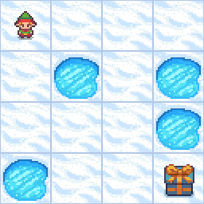
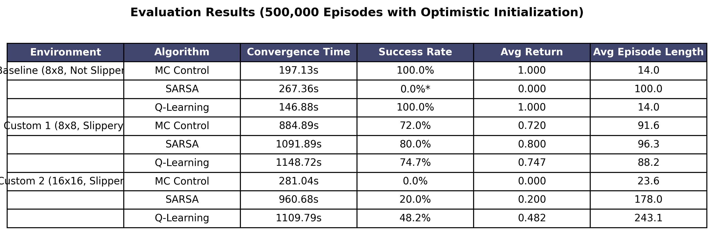

# 🧊 Conquering the Frozen Lake: My Journey into Reinforcement Learning

It all started with a simple fascination: **How do machines actually learn from trial and error?** 

I had been reading up on the fundamentals of Reinforcement Learning (RL) and decided it was time to stop reading and start coding. I wanted a challenge that was visually simple but mathematically brutal. Enter **Gymnasium’s Frozen Lake**. 

The premise is deceptively easy. You control an agent trying to cross a frozen lake to fetch a frisbee. 
- 🟩 **Start (S)**
- 🧊 **Frozen Ice (F)** (Safe!)
- 🕳️ **Holes (H)** (Instant death and `0` reward)
- 🎁 **Goal (G)** (The frisbee! `+1` reward)

But there's a catch: **The ice is slippery.** Even if you tell the agent to step right, there's a 66% chance it slides wildly in a perpendicular direction. 

I didn't just want to solve the standard 4x4 map. I wanted to push these algorithms to the absolute limit. So, I set up three battlegrounds:
1. **The Baseline**: A standard 8x8 map with no slipperiness (to make sure my math worked).
2. **The Slippery 8x8**: The classic stochastic environment where every step is a gamble.
3. **The 16x16 Behemoth**: A massive custom-generated 256-state map with 20% holes scattered everywhere.

Here is the arsenal of algorithms I coded from the ground up to beat it.

---

## 🧠 The Arsenal: How I Taught the Agent to Walk

### 1. Dynamic Programming (The "Cheat Code")
Before jumping into pure learning, I wanted to see what perfection looked like. Using **Value Iteration** and **Policy Iteration**, I gave the agent the full mathematical blueprint of the lake (the transition model). Because it knew exactly where every hole was and the exact probability of slipping, it solved the lake almost instantly. 

But that felt like cheating. Real RL agents don't get a map; they have to explore blindly.

### 2. Monte Carlo (MC) Control
I wrote my first pure RL algorithm: Monte Carlo. The idea is simple: let the agent run around blindly until it either gets the frisbee or falls in a hole. *Then*, look back at the entire path and assign value to the steps it took. 
- **The Result**: It worked great on the baseline! But in the slippery environments, it struggled. If it took 50 brilliant steps but slipped into a hole on step 51, MC punished the *entire* path. It was too harsh.

### 3. SARSA (The Cautious Learner)
To fix MC's problem, I moved to **Temporal Difference (TD)** learning. SARSA updates its brain *step-by-step*. It doesn't wait for the episode to end. It's an "on-policy" algorithm, meaning it takes the slipperiness and its own random exploration into account. 
- **The Result**: SARSA learned a very safe, cautious path around the holes, achieving an impressive ~82% success rate on the slippery 8x8 map!

### 4. Q-Learning (The Aggressive Optimist)
Finally, I built Q-Learning. Unlike SARSA, Q-Learning is "off-policy". When it updates its values, it assumes that its *next* step will be absolutely mathematically perfect, even if it's currently taking random exploratory steps. 
- **The Result**: It aggressively found the shortest, most optimal paths and easily conquered the 8x8 maps alongside SARSA.

---

## 🚨 The 16x16 Nightmare & The "Optimistic" Breakthrough

Everything was going great until I tested SARSA and Q-Learning on my massive 16x16 Slippery map. After running for 20,000 episodes, the success rate was a flat **0.0%**. 

I thought I had a bug. But the math was flawless. The problem was **Exploration**.

With a `0.1` Epsilon (meaning the agent takes a random step 10% of the time) and all Q-values initialized to `0`, the agent was just wandering randomly. The probability of navigating a 30-step path across slippery ice and 20% holes by pure random chance is basically zero. Because it never randomly stumbled on the frisbee, it never got a `+1` reward. It couldn't learn because it never tasted success.

### The Fix: Optimistic Initialization
Instead of initializing my agent's Q-table to `0`, I initialized it to `1.0`. I programmed the agent to be delusionally optimistic. It expected every single block of ice to hold a massive reward. 

Every time it took a step and received a `0`, it became "disappointed" and lowered the value of that tile. This single change forced the agent to systematically map out every single inch of the 16x16 grid, checking off dead-ends and holes until it inevitably found the goal without relying on random luck.

I bumped the training to **500,000 episodes**, and the result? **Q-Learning shot up to a near 50% success rate on a map that is mathematically impossible to survive 100% of the time.**

## 🚀 How to Use This Repo
This repository contains the pure, stripped-down implementations of the algorithms I used, free of clutter and ready to be plugged into any Gymnasium environment.

- `mc_control.py` 
- `sarsa.py`
- `q_learning.py`
- `dynamic_programming.py` (Value and Policy Iteration)

## 📊 The Final Results
Here is the performance snapshot across all environments after letting the agents train for 500,000 episodes with Optimistic Initialization!

Feel free to poke around, tweak the hyperparameters, and watch the agents learn!
